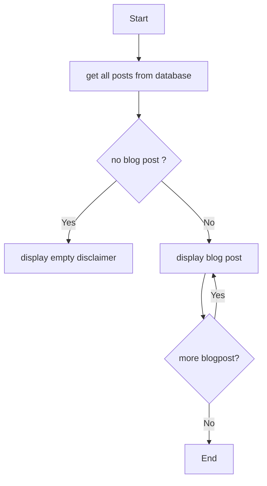
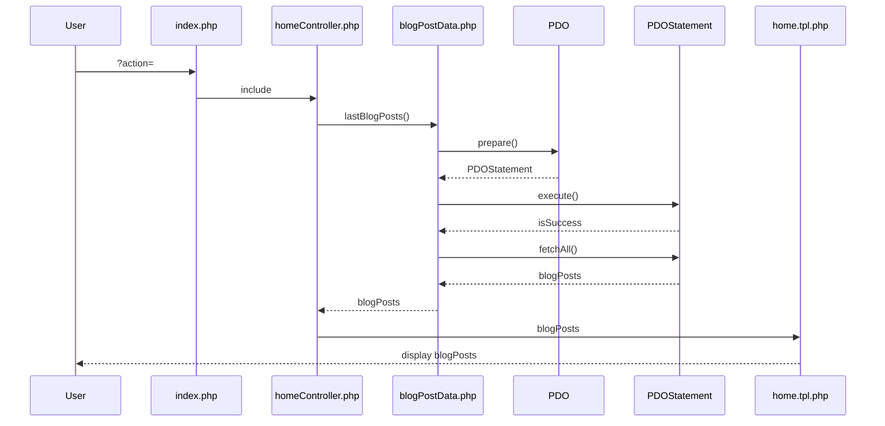
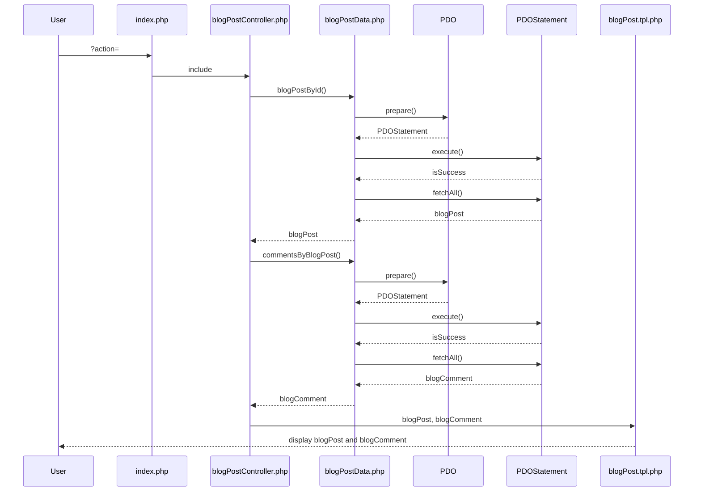
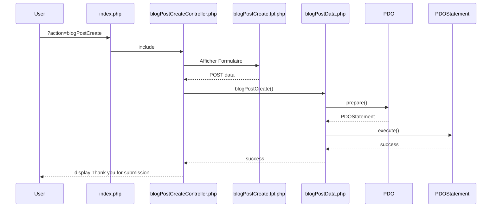
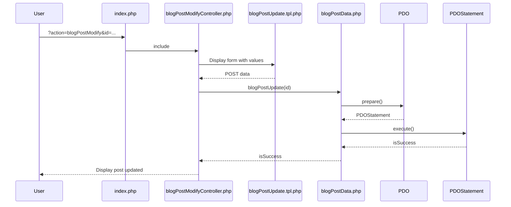

## Display latest posts : route graph 

```mermaid
graph TD
    A[Start] --> B[get all posts from database]
    B --> C{no blog post ?}
    C -- Yes --> D[display empty disclaimer]
    C -- No --> E[display blog post]
    E --> F{more blogpost?}
    F -- Yes --> E
    F -- No --> G[End]
```
## Display latest posts : Sequence diagram 

```mermaid
sequenceDiagram
    User ->> index.php: ?action=
    index.php ->> homeController.php: include
    homeController.php ->> blogPostData.php: lastBlogPosts()
    blogPostData.php ->> PDO: prepare()
    PDO -->> blogPostData.php: PDOStatement
    blogPostData.php ->> PDOStatement: execute()
    PDOStatement -->> blogPostData.php: isSuccess
    blogPostData.php ->> PDOStatement: fetchAll()
    PDOStatement -->> blogPostData.php: blogPosts
    blogPostData.php -->> homeController.php: blogPosts
    homeController.php ->> home.tpl.php: blogPosts
    home.tpl.php -->> User: display blogPosts
```
## Display post :

```mermaid
sequenceDiagram
    User ->> index.php: ?action=
    index.php ->> blogPostController.php: include
    blogPostController.php ->> blogPostData.php: blogPostById()
    blogPostData.php ->> PDO: prepare()
    PDO -->> blogPostData.php: PDOStatement
    blogPostData.php ->> PDOStatement: execute()
    PDOStatement -->> blogPostData.php: isSuccess
    blogPostData.php ->> PDOStatement: fetchAll()
    PDOStatement -->> blogPostData.php: blogPost
    blogPostData.php -->> blogPostController.php: blogPost

    blogPostController.php ->> blogPostData.php: commentsByBlogPost()
    blogPostData.php ->> PDO: prepare()
    PDO -->> blogPostData.php: PDOStatement
    blogPostData.php ->> PDOStatement: execute()
    PDOStatement -->> blogPostData.php: isSuccess
    blogPostData.php ->> PDOStatement: fetchAll()
    PDOStatement -->> blogPostData.php: blogComment
    blogPostData.php -->> blogPostController.php: blogComment

    blogPostController.php ->> blogPost.tpl.php: blogPost, blogComment
    blogPost.tpl.php -->> User: display blogPost and blogComment
```

## Créer un article :

```mermaid
sequenceDiagram
    User ->> index.php: ?action=blogPostCreate
    index.php ->> blogPostCreateController.php: include
    blogPostCreateController.php ->> blogPostCreate.tpl.php: Afficher Formulaire
    blogPostCreate.tpl.php -->> blogPostCreateController.php: POST data
    blogPostCreateController.php ->> blogPostData.php: blogPostCreate()
    blogPostData.php ->> PDO: prepare()
    PDO -->> blogPostData.php: PDOStatement
    blogPostData.php ->> PDOStatement: execute()
    PDOStatement -->> blogPostData.php: success
    blogPostData.php -->> blogPostCreateController.php: success

    blogPostCreateController.php -->> User: display Thank you for submission
```

## Modifer un article :

```mermaid
sequenceDiagram
    User ->> index.php: ?action=blogPostModify&id=...
    index.php ->> blogPostModifyController.php: include

    blogPostModifyController.php ->> blogPostUpdate.tpl.php: Display form with values
    blogPostUpdate.tpl.php -->> blogPostModifyController.php: POST data
    
    blogPostModifyController.php ->> blogPostData.php: blogPostUpdate(id)
    blogPostData.php ->> PDO: prepare()
    PDO -->> blogPostData.php: PDOStatement
    blogPostData.php ->> PDOStatement: execute()
    PDOStatement -->> blogPostData.php: isSuccess
    blogPostData.php -->> blogPostModifyController.php: isSuccess

    blogPostModifyController.php -->> User: Display post updated


```
